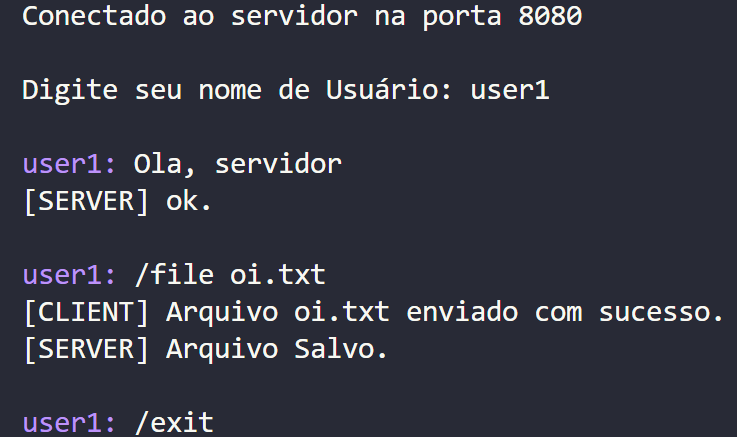
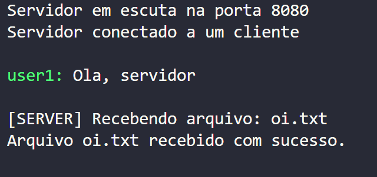

# Trabalho Camadas de Transporte e Aplicação

Repositório para o Trabalho da disciplina "SSC0142 - Redes de Computadores" do ICMC - USP.

## Grupo
| NUSP  | Nome |
| ------------- | ------------- |
| 13672220  | Camila Donda Ronchi  |
| 13837432  | Gabriel Sousa Santos de Almeida  |
| 13836813 | Lucas Piovani Ferreira |
| 13782369 | Luis Henrique Giorgetti Dantas |

## Descrição do Trabalho
O mecanismo	que	oferece	capacidade para	 troca de informações em rede mais utilizado atualmente é chamado socket. Um socket define um mecanismo de troca de dados entre dois ou mais processos distintos, processos estes que podem	estar em execução na mesma	máquina	ou em máquinas diferentes, porém ligadas em rede. Uma vez estabelecida à ligação entre dois processos por meio dos sockets, podem ser enviados dados em ambos os sentidos até que um dos pontos termine a ligação.

## Objetivo

Desenvolvemos um sistema de comunicação cliente-servidor usando sockets TCP, com foco na interação eficiente entre múltiplos clientes e um servidor central. O socket TCP permitiu comunicação bidirecional confiável, e o sistema suportou múltiplos clientes simultâneos sem interferências mútuas.

Implementamos a troca de mensagens e a transferência de arquivos entre clientes e servidor, garantindo a integridade dos dados. O servidor exibia as mensagens com o nome do remetente, facilitando a organização das interações. Além disso, criamos a pasta serverArqs no servidor para armazenar os arquivos enviados pelos clientes de forma segura e centralizada.

O resultado foi um sistema robusto, eficiente e organizado para comunicação e transferência de arquivos entre múltiplos usuários e o servidor.

## Compilação

O trabalho foi desenvolvido em c/c++.

Dentro da pasta raiz do projeto rode primeiro o Servidor com:
> g++ server.cpp -o server

>./server

Depois rode quantos clientes desejar com:
> g++ client.cpp -o client

>./client

## Execução
Ao executar os comandos de compilação, será possível enviar mensagens e arquivos do cliente.

1. Digite o seu username

2. Digite a mensagem que desejar, podendo ser:

    2.1. Mensagem de texto

    2.2. Arquivo com o comando `/file <nome_arquivo>`

    2.3. Desconectar do servidor com o comando `/exit`

### Exemplo de cliente:

## Exemplo do servidor:
O servidor basicamente recebe informações dos clientes e printa-as na tela.

